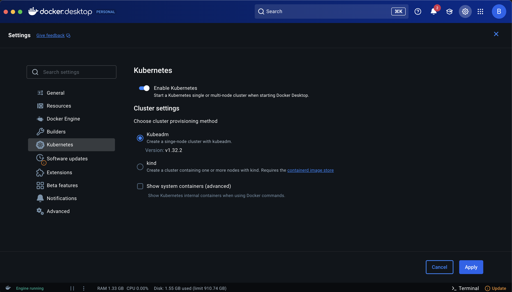

# Notes on setting up a new machine

## Table of Contents

- [Homebrew](#homebrew)
- [Install NVM (Node Version Manager)](#install-nvm-node-version-manager)
- [MKCERT (SSL for Localhost)](#mkcert-ssl-for-localhost)
- [Docker & Docker Compose](#docker--docker-compose)
- [MicroK8s](#microk8s)
- [Kubernetes Setup](#kubernetes-setup)
- [Enable Kubernetes (Visual Guide)](#enable-kubernetes-visual-guide)
- [Keycloak Get started](#keycloak-get-started)
- [Keycloak Local SSL](#keycloak-local-ssl)
- [Pyenv (manage multiple versions of Python)](#python--pyenv-manage-multiple-versions-of-python)
- [Python Version Setup](#python-version-setup)

## Homebrew

### Homebrew "brew" package manager (old ruby script still works)
/usr/bin/ruby -e "$(curl -fsSL https://raw.githubusercontent.com/Homebrew/install/master/install)"

/opt/homebrew/bin/brew

### Update .zshrc for brew
cd ~
nano .zshrc

### Add Homebrew to path (brew)

eval "$(/opt/homebrew/bin/brew shellenv)"

### Add Node Version Manager (nvm)

export NVM_DIR="$HOME/.nvm"
  [ -s "/opt/homebrew/opt/nvm/nvm.sh" ] && \. "/opt/homebrew/opt/nvm/nvm.sh"  # This loads nvm
  [ -s "/opt/homebrew/opt/nvm/etc/bash_completion.d/nvm" ] && \. "/opt/homebrew/opt/nvm/etc/bash_completion.d/nvm"

### Save and load .zshrc 
control+x
source .zshrc

## Install NVM (Node Version Manager)

brew update
brew install wget
brew install tree
brew install nvm

### Install Node

nvm i [version]


## MKCERT (SSL for Localhost)

### Install mkcert

brew install mkcert
brew install nss
mkcert -install

### Use mkcert

mkcert localhost
mkcert dev.local

### Config dev domain 

sudo nano /etc/hosts

  127.0.0.1       dev.local

sudo killall -HUP mDNSResponder


### Docker & Docker Compose
Install Docker and Docker Compose using Homebrew:

```sh
brew install docker
brew install docker-compose
```

And Download Docker Desktop from [docker.com](https://www.docker.com/products/docker-desktop/).

### MicroK8s
Install MicroK8s using Homebrew:

```sh
brew install ubuntu/microk8s/microk8s
```

Initialize MicroK8s with custom resources:

```sh
microk8s install --cpu 4 --mem 16 --disk 50
```

## Kubernetes Setup

Check your kubectl client version:

```sh
kubectl version --client
```

Start Docker, enable Kubernetes in Docker Desktop preferences, and restart Docker.

After Kubernetes is enabled, check cluster info:

```sh
kubectl cluster-info
```

## Enable Kubernetes (Visual Guide)

[](img/enable-kubernetes.png)


## Keycloak Get started

https://www.keycloak.org/getting-started/getting-started-docker

docker run -p 127.0.0.1:8080:8080 -e KC_BOOTSTRAP_ADMIN_USERNAME=admin -e KC_BOOTSTRAP_ADMIN_PASSWORD=admin quay.io/keycloak/keycloak:26.3.3 start-dev

http://localhost:8080/admin

## Keycloak Local SSL

Docker for Mac volume mounts behave differently than the base Docker system. This is mostly because Docker tries to comply with Apple's filesystem sandbox guidelines.

As shown in Docker's preferences, only certain paths are exported by macOS.

/Users
/Volumes
/tmp
/private

### (OLD) Make a dev key pair

openssl req -newkey rsa:2048 -nodes \
  -keyout localhost-key.pem -x509 -days 3650 -out localhost.pem

### (BETTER) Make a dev key pair using mkcert (see the Angular project)

brew install mkcert
mkcert -install
mkcert localhost

### copy the files to a folder then chmod the key

chmod 755 localhost-key.pem

### Run Keycloack using ssl keys

docker run \
  --name keycloak \
  -e KEYCLOAK_ADMIN=admin \
  -e KEYCLOAK_ADMIN_PASSWORD=password \
  -e KC_HTTPS_CERTIFICATE_FILE=/Users/DBenoy/certs/keycloak/localhost.pem \
  -e KC_HTTPS_CERTIFICATE_KEY_FILE=/Users/DBenoy/certs/keycloak/localhost-key.pem \
  -v $PWD/localhost.pem:/Users/DBenoy/certs/keycloak/localhost.pem \
  -v $PWD/localhost-key.pem:/Users/DBenoy/certs/keycloak/localhost-key.pem \
  -p 8443:8443 \
  quay.io/keycloak/keycloak \
  start-dev

### Navigate to Keycloak

  https://localhost:8443/admin


## Pyenv (manage multiple versions of Python)

```bash
# Install dependencies
brew install openssl readline sqlite3 xz zlib tcl-tk
brew install pyenv

# Check your shell
echo $SHELL

# Edit shell configuration (add pyenv to PATH)
sudo nano ~/.zshrc
```

Add to `~/.zshrc`:
```bash
# Add pyenv
export PATH="$(pyenv root)/shims:$PATH"
```

```bash
# Reload shell configuration
source ~/.zshrc 

# Install Python and check versions
pyenv install 3.9.19
pyenv versions

# Install virtualenv
brew install virtualenv

# Edit AWS config (when ready)
sudo nano ~/.aws/config
```

## Python Version Setup

```bash
# Set Python 3.9.19 for the project (not global)
cd services/ai
pyenv local 3.9.19
python --version  # Should show Python 3.9.19
```

### 2. Create Virtual Environment
```bash
# Remove any existing venv
rm -rf venv

# Create new venv with Python 3.9.19
python -m venv venv
source venv/bin/activate
python --version  # Verify it shows 3.9.19
```
